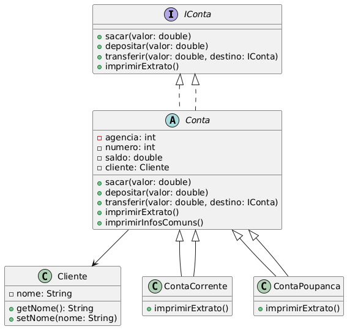

# 💳 Sistema Bancário Digital em Java

Este projeto implementa um sistema de banco digital simples, desenvolvido com Java e exercitando os pilares de **Programação Orientada a Objetos (POO)**.

---

## 📁 Estrutura do Projeto

```
banco-java/
├── docs/
│   └── diagrama.png          
├── src/
│   └── br/
│       └── com/
│           └── vini/
│               └── bancodigital/
│                   ├── App.java
│                   ├── Cliente.java
│                   ├── Conta.java
│                   ├── ContaCorrente.java
│                   ├── ContaPoupanca.java
│                   └── IConta.java
├── .gitignore
├── LICENSE
└── README.md
```

---

## ⚙️ Funcionalidades

* 📌 Criação de clientes
* 💰 Abertura de contas (corrente e poupança)
* ➕ Depósito em conta
* ➖ Saque de valores
* 🔁 Transferência entre contas
* 📄 Impressão de extrato

---

## 🧹 Diagrama UML

Abaixo está o diagrama de classes UML que representa a arquitetura do sistema.

### 📷 Visualização




---

## ▶️ Como Executar

1. Clone o repositório:

   ```bash
   git clone https://github.com/Vini9-6/banco-java.git
   ```

2. Abra o projeto em sua IDE Java preferida (VS Code, IntelliJ IDEA, Eclipse etc.).

3. Compile e execute a classe `App.java`.

---

## 🛠️ Tecnologias Utilizadas

* Java 17 ou superior
* Paradigma de Programação Orientada a Objetos (POO)
* IDEs recomendadas: Visual Studio Code, IntelliJ IDEA, Eclipse

---

## 🤝 Contribuições

Contribuições são bem-vindas! Se você quiser sugerir melhorias ou correções, sinta-se à vontade para abrir uma issue ou enviar um pull request.

---

## 📄 Licença

Este projeto está licenciado sob a [Licença MIT](LICENSE).
